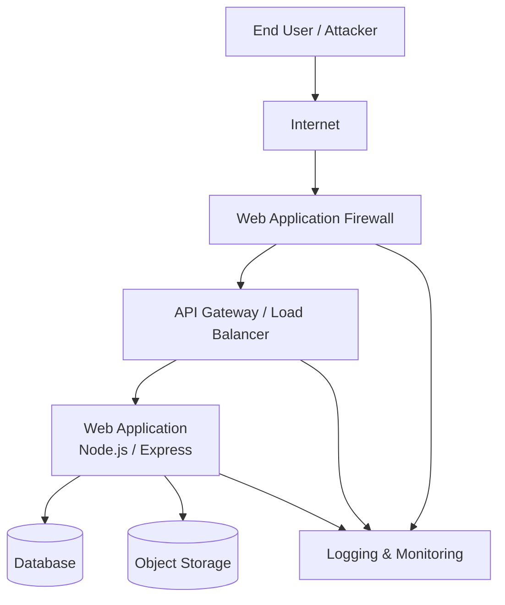

# 🛡️ Pre-Cloud Web Application Security Assessment

## 📌 Table of Contents
- [Overview](#-overview)
- [Project Objectives](#-project-objectives)
- [Technologies Involved](#-technologies-involved)
- [Tools Used](#-tools-used)
- [Methodology](#-methodology)
- [Key Findings](#-key-findings)
- [Threat Model Summary](#threat-model-summary)
- [Cloud Security Mapping](#-cloud-security-mapping)
- [Architecture Overview](#architecture-overview)
- [Setup](#-setup-optional--lab-environment)
- [Future Improvements](#future-improvements)
- [Assumptions & Limitations](#assumptions--limitations)
- [Key Takeaways](#key-takeaways)
- [Disclaimer](#-disclaimer)
- [Author](#-author)


## 📌 Overview
This project presents a **web vulnerability scanning and security assessment report** focused on identifying risks **before deploying an application to a cloud environment**.  
The objective is to adopt a **shift-left security approach**, ensuring that common web application vulnerabilities and misconfigurations are addressed early to reduce cloud attack surfaces.

The assessment is conducted in a **controlled lab environment** using deliberately vulnerable applications and industry-standard security tools.

---

## 🎯 Project Objectives
- Identify common web application vulnerabilities prior to cloud deployment  
- Analyze risks aligned with **OWASP Top 10**  
- Provide actionable remediation and **pre-cloud hardening recommendations**  
- Map application vulnerabilities to **cloud-native security controls**  

---

## 🧰 Technologies Involved
### Web Technologies
- HTTP / HTTPS  
- HTML  
- JavaScript (client-side behavior analysis)  
- REST-style web requests and responses  

### Server-side Environment (Test Application)
- Deliberately vulnerable web applications such as:
  - **OWASP Juice Shop**
  - **DVWA**
- Backend technologies used by the test applications:
  - **Node.js / PHP**

> No custom application development is performed. The focus is on **security assessment and analysis**.


## 🔍 Tools Used
The following industry-standard tools were used during the assessment:

- **OWASP ZAP** – Primary automated and manual vulnerability scanner  
- **Burp Suite (Community Edition)** – Manual request inspection and validation  
- **Nikto** – Web server and configuration vulnerability scanning  
- **Nmap** – Basic network and service exposure identification  

All tools were used in a **non-intrusive and ethical testing environment**.

---

## 🧪 Methodology
The assessment follows a structured security testing approach:

1. **Reconnaissance & Application Mapping**  
   - Identify application endpoints and functionality  

2. **Automated Scanning**  
   - Detect common vulnerabilities and misconfigurations  

3. **Manual Validation**  
   - Verify findings to reduce false positives  

4. **Risk Classification**  
   - Assess severity and potential impact  

---

## Architecture Overview



## 📊 Key Findings
The assessment identified multiple vulnerabilities aligned with the **OWASP Top 10**, including:
- SQL Injection  
- Cross-Site Scripting (XSS)  
- Broken Authentication  
- Security Misconfiguration  
- Sensitive Data Exposure  
- Missing Security Headers  

Each finding includes:
- Description  
- Severity level  
- Technical impact  

---

## 📂 Detailed Assessment Artifacts

### Findings
- Critical Vulnerabilities: [findings/Critical_Vulnerabilities.md](findings/Critical_Vulnerabilities.md)
- High Risk Findings: [findings/High_Risk_Findings.md](findings/High_Risk_Findings.md)
- Medium Risk Findings: [findings/Medium_Risk_Findings.md](findings/Medium_Risk_Findings.md)
- Low Risk Findings: [findings/Low_Risk_Findings.md](findings/Low_Risk_Findings.md)

### Scan Results
- OWASP ZAP: [scan-results/OWASP_ZAP_Scan_Results.md](scan-results/OWASP_ZAP_Scan_Results.md)
- Nikto: [scan-results/Nikto_Scan_Output.md](scan-results/Nikto_Scan_Output.md)
- Burp Suite: [scan-results/Burp_Suite_Findings.md](scan-results/Burp_Suite_Findings.md)
- Nmap: [scan-results/Nmap_Service_Discovery.md](scan-results/Nmap_Service_Discovery.md)

### Reports & Remediation
- Executive Summary: [reports/Executive_Summary.md](reports/Executive_Summary.md)
- Full Assessment Report: [reports/Full_Security_Assessment_Report.md](reports/Full_Security_Assessment_Report.md)
- Vulnerability Details: [reports/Vulnerability_Details.md](reports/Vulnerability_Details.md)
- Application Fixes: [remediation/Application_Level_Fixes.md](remediation/Application_Level_Fixes.md)
- Configuration Hardening: [remediation/Configuration_Hardening.md](remediation/Configuration_Hardening.md)


## 🛠️ Recommendations
Recommendations are provided at multiple levels:

- **Application-level remediation**
- **Security configuration improvements**
- **Pre-cloud deployment hardening measures**
- Secure handling of authentication and data

---

## Threat Model Summary

### Primary Threat Actors
- External attackers
- Automated bots
- Malicious authenticated users

### Key Attack Vectors
- Injection attacks (SQLi, command injection)
- Authentication bypass
- Insecure file uploads
- Excessive permissions

### High-Value Assets
- User credentials
- Personally Identifiable Information (PII)
- Application source logic
- Backend infrastructure

### Trust Boundaries
- Internet → WAF
- WAF → Application
- Application → Database
- Application → Object Storage

## ☁️ Cloud Security Mapping
Each vulnerability is mapped to **cloud-native mitigation strategies**, such as:

- Web Application Firewall (WAF) rules  
- Secure access control and identity management  
- Network exposure reduction  
- Secure deployment best practices  
This demonstrates how addressing issues early improves **cloud security posture**.

## ⚙️ Setup (Optional – Lab Environment)
This project does not require custom code execution.

Optional setup for testing:
- Deploy OWASP Juice Shop or DVWA locally or in a lab environment
- Run scanning tools with default configurations
- Analyze and document findings


## ▶️ How to Run the Security Scans

All security testing was performed in a **controlled lab environment** using intentionally vulnerable web applications.  
No production or real-world systems were tested.

---

### OWASP ZAP
Used for automated vulnerability discovery and baseline testing.

```bash
zap.sh
```

**Steps:**
- Configure browser proxy to `127.0.0.1:8080`
- Spider the target application
- Run Active Scan
- Export scan results

---

### Nikto
Used to identify server-side misconfigurations and insecure defaults.

```bash
nikto -h http://localhost:3000
```

---

### Burp Suite (Community Edition)
Used for manual validation and business logic testing.

**Steps:**
- Configure browser proxy (`127.0.0.1:8080`)
- Intercept requests
- Modify parameters using Repeater
- Validate exploitability manually

---

### Nmap
Used to identify exposed services and open ports.

```bash
nmap -sS -sV -Pn -T4 localhost
```

## Future Improvements

- Integrate SAST and dependency scanning (Snyk, Semgrep)
- Add container security scanning
- Implement CI/CD security gates
- Expand cloud security mapping for Azure and GCP
- Perform authenticated scanning and role-based testing


## Assumptions & Limitations

- Testing performed in an isolated lab environment
- No denial-of-service testing conducted
- Cloud deployment simulated, not production
- Findings based on time-boxed assessment

---

## Key Takeaways

- Performed a full pre-cloud security assessment combining automated scanning and manual validation
- Identified and triaged vulnerabilities using OWASP Top 10 and CVSS
- Demonstrated defense-in-depth by combining application fixes with cloud-native controls
- Mapped application risks to AWS security services (WAF, IAM, Secrets Manager, Monitoring)
- Highlighted limitations of automated tools through false-positive analysis

## 📄 Disclaimer
This project is created **strictly for educational and portfolio purposes**.

- No real-world or production systems were tested  
- No sensitive or confidential data is included  
- All activities were conducted in a controlled lab environment  

---

## 👤 Author
**Sakshat S**  
Aspiring Cloud Security Engineer  
Focused on pre-cloud security, risk reduction, and secure cloud adoption
